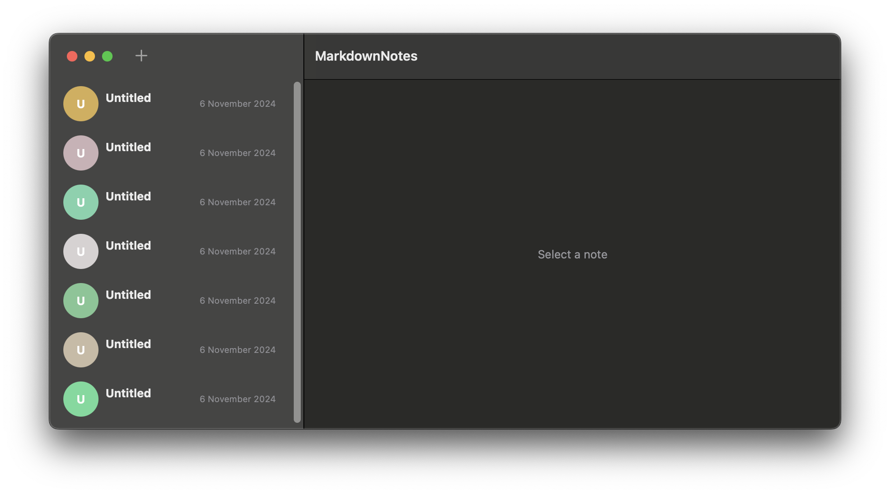

# MarkdownNotes

MarkdownNotes is a macOS desktop application designed to help users quickly take and manage notes using Markdown. Inspired by Telegram's clean and minimalist UI, MarkdownNotes offers an intuitive interface with a sidebar listing all your notes, easy navigation, and seamless Markdown editing and previewing capabilities.



## Features

- **Telegram-Inspired UI:**
  - Clean and minimalist design with a sidebar for easy navigation.
  - List of notes displayed similarly to Telegram's chat list, showing note title, snippet, and last modified date.
  
- **Markdown Support:**
  - Rendered Markdown preview similar to VSCode's Markdown preview.
  - Seamless switching between rendered view and raw Markdown editor.
  
- **Note Management:**
  - Create, edit, and delete notes effortlessly.
  - Automatic generation of note icons with initials and random colors for easy identification.
  - Search functionality to quickly find notes.
  
- **Customization:**
  - Support for light and dark themes.
  - Customizable sidebar and note detail views.
  
- **Data Persistence:**
  - Notes are saved locally and persist across app launches.
  
## Screenshots

*(Will be added soon)*

## Installation

### Prerequisites

- **macOS 12.0** or later.
- **Xcode 14** or later with SwiftUI support.

### Steps

1. **Clone the Repository:**

   ```bash
   git clone git@github.com:YourUsername/MarkdownNotes.git
   ```

2. **Navigate to the Project Directory:**

   ```bash
   cd MarkdownNotes
   ```

3. **Open the Project in Xcode:**

   ```bash
   open MarkdownNotes.xcodeproj
   ```

4. **Build and Run:**

   - Select the desired scheme (e.g., MarkdownNotes).
   - Click the **Run** button (`⌘R`) or press `⌘R` to build and launch the application.

## Usage

1. **Creating a New Note:**
   - Click the **+** button in the sidebar to create a new note.
   - Enter the title and start typing your Markdown content.

2. **Editing a Note:**
   - Select a note from the sidebar.
   - Click the **Edit** button to switch to the raw Markdown editor.
   - Make your changes and click **Done** to save.

3. **Viewing Notes:**
   - Select a note from the sidebar to view the rendered Markdown content.

4. **Searching Notes:**
   - Use the search bar at the top of the sidebar to filter notes by title or content.

## Contributing

Contributions are welcome! 

## License

This project is licensed under the [MIT License](./LICENSE).

